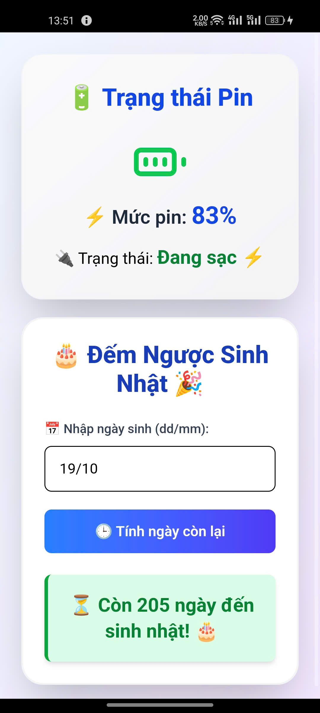
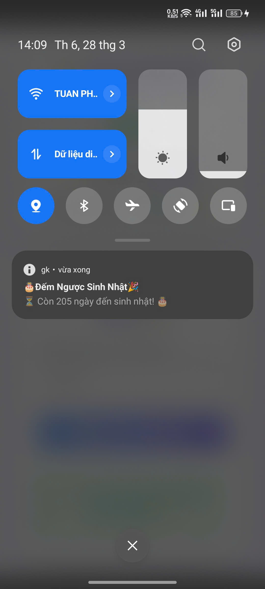
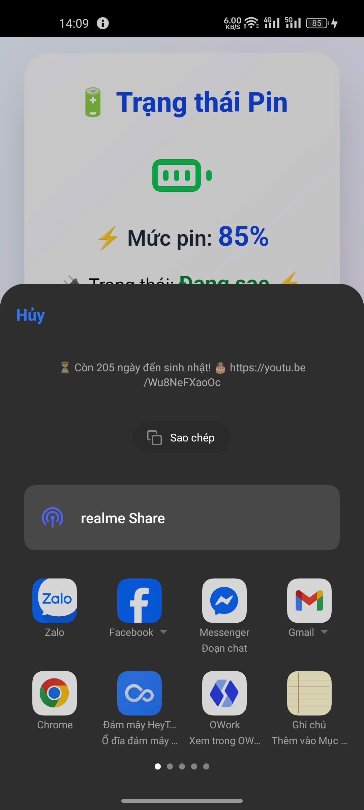
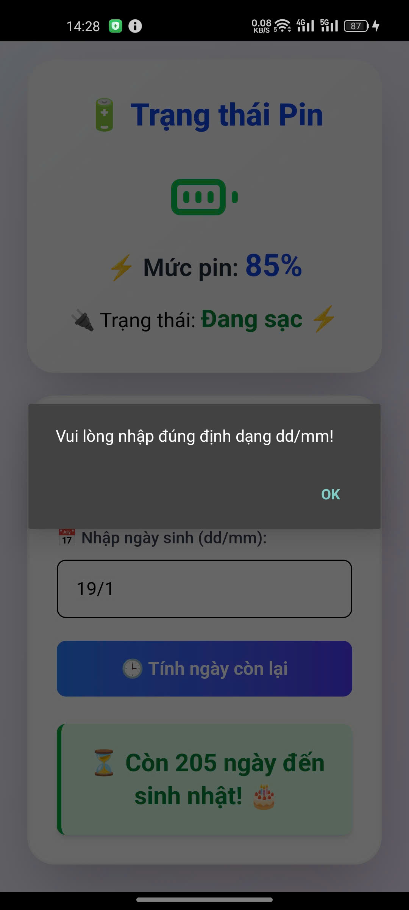

# 🚀 Capacitor + ReactJs - Midterm

📱 **Dự án Midterm sử dụng Capacitor và ReactJS để phát triển ứng dụng di động.**

---
## ✅ Yêu cầu hệ thống
Trước khi bắt đầu, hãy đảm bảo bạn đã cài đặt các công cụ sau:

- 📌 **JDK 17** → [Tải tại đây](https://www.oracle.com/java/technologies/javase/jdk17-archive-downloads.html)
- 📌 **Android SDK 35**
- 📌 **Node.js & npm** (khuyên dùng phiên bản LTS)
- 📌 **Android Studio** (nếu chạy trên Android)

---
## 🚀 Hướng dẫn cài đặt

### 1️⃣ Clone source code
Chạy lệnh sau để tải mã nguồn về máy:

```bash
git clone https://github.com/ron19102004/capacitor-reactjs-midterm.git
```
### 2️⃣ Cài đặt dependencies  
Di chuyển vào thư mục dự án và cài đặt các gói cần thiết:
```bash
cd capacitor-reactjs-midterm
npm install
```
### 3️⃣  Chạy ứng dụng

📌 **Mở ứng dụng trên Android bằng Capacitor:**

```bash
npx cap sync android
npx cap open android
```
🔹 Lưu ý:
- Nếu chạy trên Android, hãy đảm bảo thiết bị hoặc trình giả lập đã kết nối.
- Nếu gặp lỗi thiếu thư viện, thử chạy:
  ```bash
    npm install 
    npx cap sync
    ```
---

## 📁 Cấu trúc thư mục

Dưới đây là cấu trúc thư mục chính của dự án:

```
📂 capacitor-reactjs-midterm
├── 📁 src
│   ├── 📁 assets          # Chứa hình ảnh, icon...
│   ├── 📁 components      # Các component custom
│   ├── 📁 hooks           # Custom hooks
│   ├── 📄 App.tsx         # File chính của ứng dụng
│   ├── 📄 main.tsx        # Entry point của ứng dụng
│   ├── 📄 index.css       # File CSS chính
├── 📄 package.json        # Dependencies và scripts
├── 📄 capacitor.config.ts # Cấu hình Capacitor
├── 📄 tsconfig.json       # Cấu hình TypeScript
├── 📄 vite.config.ts      # Cấu hình Vite
└── 📁 android             # Chứa project android được generate từ capacitor
```
---
## 🎨 Giao diện ứng dụng  

✨ **Dưới đây là một số ảnh chụp màn hình của ứng dụng:**  

<p align="center">
  
  
  
  
</p>

---
## 🤝 Đóng góp & Liên hệ

🔗 **GitHub:** [github.com/ron19102004](https://github.com/ron19102004)  
📧 **Email:** [dungtna.22itb@vku.udn.vn](mailto:dungtna.22itb@vku.udn.vn)

💡 Nếu bạn thấy dự án hữu ích, hãy **⭐ Star** repo để ủng hộ nhé! 🚀  

